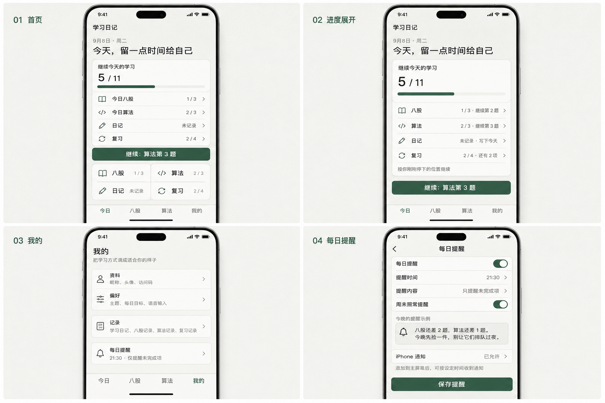

# 雾色画册 v2：移动端最终设计与开发规范

状态：**视觉冻结，可进入开发**

设计基线：`a544042`

基准设备：iPhone，`390 × 844 CSS px`
最终总览：[mist-album-v2-2x2.png](assets/mist-album-v2-2x2.png)

## 1. 目标与取舍

产品只围绕四件事展开：**八股、算法、日记、复习**。首页负责回答两个问题：“今天完成了多少？”和“下一步做什么？”。删除“今日推荐”、学习时长统计、重复复习卡片、快捷记录侧栏和解释性长文案。

“我的”改为独立页面，承载资料、偏好、记录和每日提醒。每日提醒按发送时仍未完成的项目生成文案，并通过 iPhone 的系统通知到达用户。

视觉继续沿用已选的雾灰绿，但把名称定为“雾色画册”：像一本每天翻一页的薄册，而不是数据仪表盘。保留纸面、墨色、细线与单一植物绿，不增加新品牌色或装饰系统。

## 2. 当前 UI 审计

审计依据是本轮实际查看的现有 390 × 844 设计导出 [01-today.png](../mobile-app/design/exploration/mist-sage/01-today.png)、[05-review-list.png](../mobile-app/design/exploration/mist-sage/05-review-list.png)，以及当前 `TodayPage`、移动导航、`MobileMoreSheet` 和路由结构。未把旧图稿当作已上线界面。

| 步骤 | 当前体验 | 健康度 | 结论 |
| --- | --- | --- | --- |
| 1 | 从“今日”进入 | 需收敛 | 现有首页同时出现继续训练、三条开始入口、今日算法推荐、日记快捷入口、复习队列和统计，核心动作被重复表达。 |
| 2 | 判断今天完成了什么 | 缺失 | 当前能看到局部题数和时长，但没有八股、算法、日记、复习四项统一进度；用户仍要在多个区块中拼信息。 |
| 3 | 进入“我的” | 需重构 | 当前“我的”是底部弹层，混排写日记、历史、设置、安装和访问码，无法形成稳定的个人设置位置。 |
| 4 | 设置每日提醒 | 缺失 | 目前只有桌宠本地通知开关，没有面向 iPhone PWA 的时间、内容、权限、预览和失败状态。 |

现有优点可以直接保留：四项底部导航稳定；专注作答页隐藏底栏；雾灰绿配色安静；现有正文尺度和 44 px 可触目标已有明确约束。

最高优先级问题：

1. 首页的“今日推荐”和多处复习/统计重复入口造成选择负担。
2. “继续”只说明单个训练位置，不能让用户一眼确认四类任务的真实完成量。
3. “我的”作为弹层容纳过多长列表，返回关系和当前位置不稳定。
4. 通知开关没有说明 iPhone 安装、授权与推送状态，容易让“已打开开关”被误解为“一定会收到”。

可访问性风险：次级文字 `#617066` 在 `#EEF3EE` 上对比度约 `4.65:1`，刚过普通文字 AA 下限，不再降低透明度；进度不能只靠绿色长度表达；开关、权限和加载状态都要有可读文本。截图不能验证 VoiceOver、键盘焦点、动态字体、系统通知到达和真实安全区行为，这些需在实现后测试。

## 3. 信息架构

### 全局导航

底部固定四项：`今日 / 八股 / 算法 / 我的`。图标沿用项目已安装的 Phosphor 图标；20 px、regular，同一笔画体系。

| 入口 | 一级页面 | 主要内容 |
| --- | --- | --- |
| 今日 | `/today` | 总进度、四项明细、唯一继续动作、四个核心入口 |
| 八股 | `/interview` | 今日八股、继续作答、八股复习与历史 |
| 算法 | `/algorithms` | 今日算法、继续讲题、算法复习与历史 |
| 我的 | `/me` | 资料、偏好、记录、每日提醒 |

“复习”作为首页核心任务存在，但不新增第五个底部 tab。它汇总八股和算法到期项；从首页进入时使用统一复习页，从科目页进入时保留科目上下文。

“日记”从首页四宫格进入；历史统一放在“我的 → 记录”。

### 我的页层级

- `/me`：独立根页，底部“我的”高亮。
- `/me/profile`：昵称、头像、访问码。
- `/me/preferences`：主题、每日目标、语音输入偏好。
- `/me/records`：日记、八股、算法、复习四类记录入口。
- `/me/reminder`：每日提醒设置。作为 push 进入页，顶部返回“我的”，隐藏底部导航。

## 4. 首页最终规范

### 首屏顺序

1. 状态栏与安全区。
2. `学习日记`、日期、最多一行短问候。
3. `继续今天的学习`：总进度、进度条、四项明细。
4. 一个满宽主按钮，继续最合适的未完成动作。
5. `八股 / 算法 / 日记 / 复习` 四入口。
6. 底部导航。

首页不出现“今日推荐”“推荐题”“换一批”、学习时长、累计统计、成就或第二个主按钮。

### 今日进度模型

示例数据固定表达为：

| 项目 | 视觉文案 | 计入总进度 |
| --- | --- | --- |
| 八股 | `今日八股 1 / 3` | `1 / 3` |
| 算法 | `今日算法 2 / 3` | `2 / 3` |
| 日记 | `日记 未记录` | `0 / 1` |
| 复习 | `复习 2 / 4` | `2 / 4` |
| 合计 | `5 / 11` | 四项分子、分母分别求和 |

规则：

- 分母来自“我的 → 偏好 → 每日目标”；日记恒为 1 次。
- 某项目标为 0 时不计入合计，但该入口仍保留，状态显示“今日不设目标”。
- 完成超过目标时，行内可显示 `4 / 3`，总进度最多绘制为 100%，不吞掉额外完成量。
- 复习分母是当日开始时的到期数；当天新产生的复习进入明日，避免分母越做越大。
- 任一数据源失败时不显示 `0`。总栏改为“部分进度待同步”，失败行显示“待同步”，其余行正常可用。
- 进度条下方必须保留 `5 / 11` 文字；VoiceOver 标签为“今日共十一项，已完成五项”。

### 展开与继续

默认态显示四行紧凑状态。点模块标题、进度条或任一行进入展开态；展开态不弹新卡片，只将每行补成明确动作：

- `八股 1 / 3 · 继续第 2 题`
- `算法 2 / 3 · 继续第 3 题`
- `日记 未记录 · 写下今天`
- `复习 2 / 4 · 还有 2 项`

主按钮文案使用真实落点，例如 `继续：算法第 3 题`。落点优先级：当前存在的进行中会话中最近操作的一项 → 最早到期复习 → 未完成的八股/算法 → 未记录日记。用户点过某一行后，该行成为本次会话的继续目标。

全完成时模块显示 `11 / 11` 和“今天的四件事都收好了”，主按钮变为次级的“写点补充日记”；不开启新的推荐流。

### 四个核心入口

使用一个 2 × 2 平面分区，整体只有一层 `surface`，内部用 1 px 线分隔。每格高 64 px，包含 20 px 图标、17 px 名称和 14 px 状态；整格可触。不要做四张浮卡。

## 5. 我的页最终规范

页面标题为“我的”，说明为“把学习方式调成适合你的样子”。内容按四组排列：

| 分组 | 首页摘要 | 进入后内容 |
| --- | --- | --- |
| 资料 | `昵称、头像、访问码` | 编辑昵称/头像；访问码单独遮罩显示，清除需确认 |
| 偏好 | `主题、每日目标、语音输入` | 浅色/深色；八股与算法目标；系统键盘语音提示偏好 |
| 记录 | `学习日记、八股记录、算法记录、复习记录` | 四类历史入口，保留各自原有详情页 |
| 每日提醒 | `21:30 · 仅提醒未完成项` | 时间、内容、周末、权限、预览 |

一级页每组一行或一组，不把具体表单全部铺开。行高至少 64 px，标题 17 px，摘要 14 px，末端 chevron 不承担唯一可点击区域。

“我的”必须是路由页，不再以 `dialog` 或 bottom sheet 承载。iOS 安装引导、主题、访问码分别归入资料或偏好，避免继续混排成工具清单。

## 6. 每日提醒

### 页面结构

1. `每日提醒` 总开关。
2. `提醒时间`，默认 `21:30`，使用系统时间选择器。
3. `提醒内容`：默认“只提醒未完成项”；可选“无论是否完成都总结”。
4. `周末照常提醒`，默认开启。
5. `今晚的提醒示例`，实时使用当前未完成项预览。
6. `iPhone 通知` 状态行：未安装 / 待允许 / 已允许 / 已关闭 / 订阅失效。
7. 主按钮 `保存提醒`。

总开关打开不等于授权成功。只有通知订阅成功后，摘要才显示“已开启”。

### 文案生成规则

文案由“事实句 + 一句轻推”组成，最多 52 个汉字；不评价自律，不使用连续感叹号、鸡汤、责备或假装人格化的 AI 口吻。数字和项目名必须来自发送时的真实未完成项。

| 未完成情况 | 示例池 |
| --- | --- |
| 只有八股 | `八股还差 2 题。挑一道顺口的，讲完就收工。` / `还有 2 道八股没见面，今晚见一道也算。` |
| 只有算法 | `算法还差 1 题。先把思路说清楚，代码可以慢一点。` / `今天的算法差一小格，十分钟够它露个头。` |
| 只有日记 | `今天还没留下只言片语。写三行，也算给今天打个书签。` / `日记页还空着，记一个刚刚想通的点就好。` |
| 只有复习 | `有 2 项旧知识来敲门。先见一个，剩下的明天再说。` / `复习还剩 2 项，挑最眼熟的先捡起来。` |
| 两项及以上 | `八股还差 2 题，算法还差 1 题。今晚先捡一件，别让它们排队过夜。` / `日记还没写，复习还剩 2 项。给今天补一个小句号。` |
| 全部完成 | 默认不发送；若选“每日总结”，发送 `今天的四件事都收好了。到这里就好。` |

同一状态至少准备 4 个句式。选择时排除最近 3 次已发模板，再从符合当前未完成组合的池中选择；变量替换后再做长度校验。这样“每次不一样”有明确上限，也不会生成失实内容。

通知标题固定为 `学习日记`，正文使用上述动态文案。点击通知进入优先未完成项；若有两个以上项目，进入首页展开态并高亮对应行。应用角标可显示未完成总数，全部完成后清零。

### iPhone 权限与发送边界

iPhone 上的 PWA Web Push 需要 iOS/iPadOS 16.4 或更高版本，并且网页已添加到主屏幕；授权请求必须紧跟用户点击“允许通知”的直接操作。授权后通知会进入锁屏和通知中心，并受系统“专注模式”控制。依据：[WebKit 的 iOS/iPadOS Web Push 说明](https://webkit.org/blog/13878/web-push-for-web-apps-on-ios-and-ipados/) 与 [Apple Developer Web Push 文档](https://developer.apple.com/documentation/usernotifications/sending-web-push-notifications-in-web-apps-and-browsers)。

纯前端定时器不能保证在 PWA 关闭时准点运行。提醒时间由服务端按用户时区调度，发送前重新读取当日四项状态，再发送标准 Web Push；Service Worker 收到推送后必须立刻展示可见通知，不使用静默推送。

权限流程：

| 状态 | 页面反馈 | 主动作 |
| --- | --- | --- |
| 未添加到主屏幕 | `先添加到主屏幕，才能接入 iPhone 通知` | `查看添加方法` |
| 已安装、未询问 | `允许后才能按时提醒` | `允许通知`，由本次点按直接触发系统授权 |
| 已允许 | `iPhone 通知 · 已允许` | 可保存时间与内容 |
| 已拒绝 | `通知已在系统中关闭` | `查看系统设置方法`；不循环弹授权框 |
| 订阅失效 | `通知连接需要重新开启` | `重新开启` |
| 服务端保存失败 | 保留页面草稿，显示 `提醒设置还没保存` | `重新保存` |

时区默认 `Asia/Shanghai`，跨时区后以设备确认的新时区为准。服务端在设定时间前重新计算未完成项；超过设定时间 60 分钟的延迟消息直接丢弃，避免第二天补发旧提醒。

## 7. 视觉与尺寸

| Token / 元素 | 最终值 |
| --- | --- |
| 设计画布 | `390 × 844 CSS px`；检查 `375 / 390 / 428` 三档 |
| 页面左右边距 | 20 px；428 宽时 24 px |
| 顶部安全区 | `max(16px, env(safe-area-inset-top))` |
| 底部安全区 | `max(12px, env(safe-area-inset-bottom))` |
| 页面最大阅读宽 | 428 px，居中 |
| 间距 | `4 / 8 / 12 / 16 / 24 / 32` px |
| 问候 | 26 px / 35 px，600；最多 1 行 |
| 页面标题 | 26 px / 35 px，600 |
| 正文 | 17 px / 28 px，400 |
| 标签/元信息 | 14 px / 21 px，400 或 600 |
| 进度数字 | 30 px / 36 px，600，tabular numbers |
| 主按钮 | 350 × 52 px；14 px 圆角 |
| 列表/入口可触高度 | 最小 56 px |
| 首页进度模块 | 宽 350 px；默认约 222 px 高，展开约 294 px |
| 进度条 | 6 px 高，3 px 圆角；轨道 `#DDE5DF` |
| 底部导航 | 内容高 64 px + safe area；4 等分 |
| 页面转场 | 150–220 ms；减少动态效果时取消位移 |

颜色沿用既有 tokens：

| 用途 | 色值 |
| --- | --- |
| `canvas` | `#EEF3EE` |
| `surface` | `#FBFDFC` |
| `surface-subtle` | `#E3ECE5` |
| `ink` | `#1D2821` |
| `ink-muted` | `#617066` |
| `rule` | `#C9D4CC` |
| `accent` | `#35664D` |
| `danger` | `#9A4A43` |

实测对比度：`ink/canvas 13.57:1`、`ink-muted/canvas 4.65:1`、`accent/canvas 5.92:1`、白字/`accent 6.65:1`。次级文字不叠加透明度。

## 8. 必须覆盖的状态

- 首页：首次加载、部分接口失败、零进度、进行中、全部完成、超额完成。
- 我的：正常、访问码为空、保存失败。
- 提醒：未安装、未授权、已授权、系统拒绝、订阅失效、离线保存失败。
- 动态字体：200% 时允许纵向滚动，四项状态改为两行，不压缩到 16 px 以下。
- VoiceOver：进度条、四项行、开关、权限状态、通知预览都有完整名称和值；装饰图标隐藏。
- 触控：所有行整行可点，开关标签也可点；焦点顺序与视觉顺序一致。

## 9. 开发验收

1. 首页 DOM 中不存在“今日推荐”模块或其占位空白。
2. `1/3 + 2/3 + 0/1 + 2/4` 正确显示为 `5/11`；接口失败不被当作 0。
3. 四行分别能进入对应未完成位置，主按钮与最近任务落点一致。
4. “我的”由独立 URL 打开，浏览器返回、深链和底部选中态正确。
5. 通知授权只在用户点按后触发；拒绝后不重复弹系统权限框。
6. 实体 iPhone 验证：添加到主屏幕、授权、锁屏到达、通知中心到达、专注模式、点击深链、角标清零。
7. 375、390、428 px 宽度无横向滚动；200% 动态字体无文字截断。

本稿只冻结视觉、内容与交互规则。服务端调度、Web Push 订阅、通知发送和真实 iPhone 到达仍需开发与真机验收后才能标记完成。
